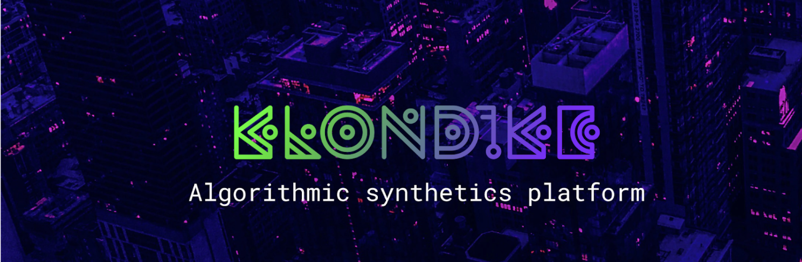

# Klondike finance protocol

Smart contracts for algorithmic synthetics platform.

## Our approach

Our goal is to create a platform for various synthetic assets based on an improved Basis stabilization model with the implementation of a stabilization fund supporting the peg in times of need. The fund and other features will be able to fix current price issues of similar protocols.

We use the Basis.Cash stabilization model, but with some major tweaks. The main drawback of the Basis model, as it turned out, is the instability of the system caused by huge rapid increases in the supply with a subsequent price fall due to insane APY on farming. The reason for that, as one could argue, is misuse of the original Basis model which wasn’t supposed to expand in supply so quickly or be “farmed” at all. We’re solving these issues with the implementation of stabilization fund.

## Stabilization fund is a smart contract with 2 functions:

- Selling the base asset for the underlying asset and storing this asset
- Selling the underlying asset for base asset

Stabilization fund is limited by these 2 functions and can’t perform any other actions.

## Stabilization mechanism

Peg > 1 BTC (XMR, LTC, DOT etc.)

- During the farming period — additional tokens are issued, which balances the price, the funds are stored in the stabilization fund
- After farming period — additional issuance is distributed among holders depending on their share

Peg < 1 BTC (XMR, LTC, DOT etc.)

- Bonds issuance
- If the bond mechanism does not cover the gap, a stabilization fund is used

Stabilization fund will make the system more sustainable in comparison with other projects by reducing the effect of post-farming dumping.

## A Stabilization Fund and a Subsidized Debt Market

– An oracle uses uniswap to get the kBTC/wBTC price. If the price is above 1, then old_supply\*(price-1) amount of kBTC is minted. After that, 50% (currently predefined and will be possible to change later via governance) goes to the stabilization fund, the other 50% goes to the KLON holders who stake them to the Boardroom.

– If the supply of a synthetic asset grows, the algorithm mints additional supply and distributes it between the stabilization fund and KLON token holders.

– In case of an excess supply, the bond market mechanism is launched, which is incentivized by switching the inflation of the KLON token to the bond liquidity market. This is a fairly known procedure.

– If the bond mechanism is not sufficient to stabilize the exchange rate, funds from the reserve fund are used.

To chat with us & stay up to date, join our [Telegram](https://t.me/klondike_discussion) or [Discord](https://discord.gg/67NXsuwZ8W).

Follow us on [Twitter](https://twitter.com/KlondikeFinance) and [Medium](https://klondikefinance.medium.com)
